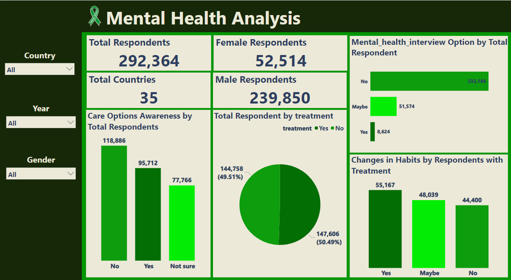
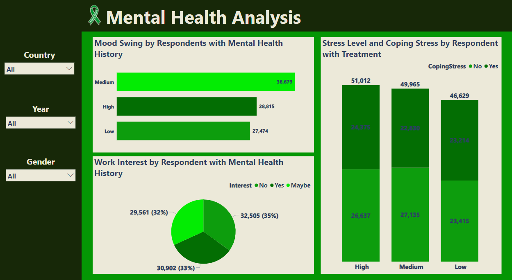

# ANALYSIS OF THE 2014 - 2016 GLOBAL MENTAL HEALTH SURVEY
## Overview
>This dataset records a global survey conducted to track trends in mental health. The data covers a range of variables such as levels of stress, depression, anxiety, subjective well-being, and use of mental health services. The survey involved respondents from various demographic backgrounds, including gender, employment status, and geographic region.
## Aim
This project aims to provide a better understanding of changes in mental health globally over the specified period. It aims to improve our understanding of mental health conditions, optimize prevention and treatment strategies, and ultimately enhance the well-being and quality of life for individuals affected by mental illness.
## Objective
>The objectives of this analysis are:
1. Reducing stigma and promoting awareness: Using data analysis to challenge misconceptions, reduce stigma, and raise awareness about mental health issues through evidence-based advocacy, education, and communication strategies
2. Treatment Effectiveness Evaluation: Evaluating the effectiveness of mental health interventions, treatments, or programs by analyzing changes in mental health outcomes before and after intervention implementation.
3. Identifying Patterns and Trends: Analyzing mental health data to identify patterns, trends, and variations in mental health indicators over time, across populations, or in response to interventions.
4. Informing Policy and Decision-Making: Providing evidence-based insights and recommendations to policymakers, healthcare providers, and stakeholders to guide resource allocation, service planning, and policy development in mental health care.

## Dataset
**Data Source:** [Mental Health Dataset] (https://www.kaggle.com/datasets/divaniazzahra/mental-health-dataset)

The dataset has 20 Columns and 292,364 Rows. Each row represents a respondent, each column contains respondent’s attributes described on the column Metadata below:
* Timestamp: Time and date of survey
* Gender: The gender of the respondent
* Country: The country where the respondent lives
* Occupation: Occupation or profession of the respondent
* Self-employed: Is the respondent self-employed or not?
* Family_history: Is there a history of mental health disorders in the respondent's family?
* Treatment: Has the respondent ever received treatment or therapy for mental health problems?
* Days_Indoors: Estimated number of days a week the respondent spends indoors.
* Growing_Stress: The current level of stress the respondent feels
* Changes_Habits: Has the respondent experienced any changes in sleeping habits or patterns?
* Mental_Health_History: Does the respondent have a previous history of mental health disorders?
* Mood_Swings: Does the respondent experience sudden mood swings?
* Coping_Struggles: Does the respondent have difficulty coping with pressure or stress?
* Work_Interest: The respondent's level of interest and motivation in their work
* Social_Weakness: Does the respondent find it difficult to interact socially or maintain relationships?
* Mental_Health_Interview: Is the respondent willing to be interviewed about their mental health?
* Care_options: Is the respondent aware of or using mental health care options?
* Days of the week - The days of the week of survey
* Month - The month the survey was conducted
* Year - The year of the survey

## Methodology
1. Data Cleaning and Transformation: The dataset was duplicated and a copy was loaded into Power bi. Then, it was taken to power query editor on power bi for cleaning and transformation. 
2. Data Visualization: Different visualizations such as bar charts, pie charts, etc were employed to visualize trends and derive actionable insights.
3. Descriptive Analysis: It was used to understnad the distribution of the data.
4. Correlation Analysis: This technique was used to examine the association between the level of stress the respondents experience and how they cope with the stress.
5. Factor Analysis: This technique was adopted to identify underlying factor such as stress level, ability to cope with stress, work interest, etc that contribute to observed patterns of mental health indicators. 

## Data Analytics Tools
**Power Bi**

## Data Visualization
 

## Insights
1. A total of 292,364 respondents took the survey across 35 countries.
2. Majority of the respondents (118.866) are not aware of the mental health care options. This may be as a result of lack of effective education and communication strategies
3. A significant population of the respondents (232,166) are not willing to grant mental health interview. This indicates that there is a very high rate of stigmatization.
4. 50.49% (147,606) of the total respondents have received treatments or therapy for mental health conditions. This indicates a very high rate of mental health conditions or illness in the populace.
5. Based on the analysis, most of the respondents with treatments experience changes in habits.
6. The percentage of respondents that do not have interest in their work is higher compared to the others. Lack of work interest is another factor that contributes to mental health conditions.

## Conclusion
* By leveraging the data-driven insights derived from this analysis,
1. Healthcare providers, policy makers and all other stakeholders should raise awareness and challenge misconceptions to reduce stigmatization about mental health issues through evidence-based advocacy, education and effective communication strategies.
2. People who have history of mental health conditions or illnesses should be encouraged to engage in work or activities that make them happy.
